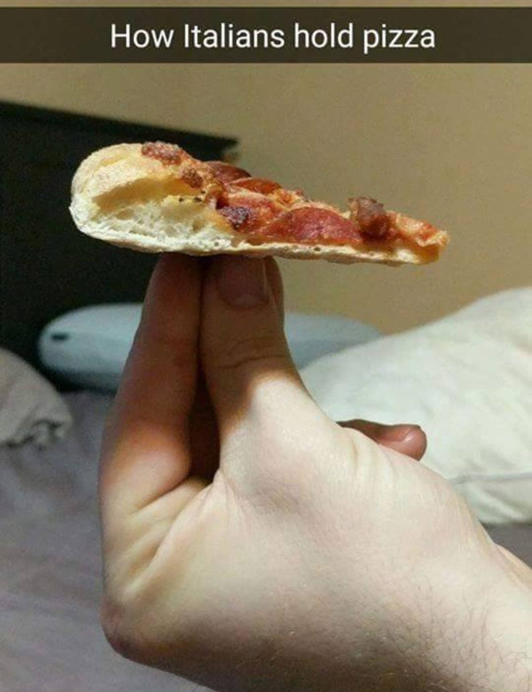

<h1 align="center">
  Spada Giropizza
</h1>

<div align="center">
  
</div>

<br>

<p align="center">
  A tiny project to random generate pizza toppings (in italian).
  <br>
  No, ananas is not on the list.
</p>

## Technologies used
  - Pnpm
  - Vite
  - Vue 3
  - UnoCSS
  - Typescript + linting
  - API auto import by `unplugin-auto-import`
  - Components auto import by `unplugin-vue-components`
  - Composables auto import by `vite-auto-import-resolvers`
  - Useful set of composable APIs by `@vueuse/core`
  - PWA support by `vite-plugin-pwa`

## Setup
  ```sh
  # use this template
  $ npx degit NicolaSpadari/giropizza my-pizza-app

  # go into the folder
  $ cd my-pizza-app

  # install dependencies
  $ pnpm install

  # start the project
  $ pnpm run dev
  ```

## Build the app
  ```sh
  $ pnpm run build
  ```

## Credits
  Inspired by [PizzaGenerator](https://pizzagenerator.it)
